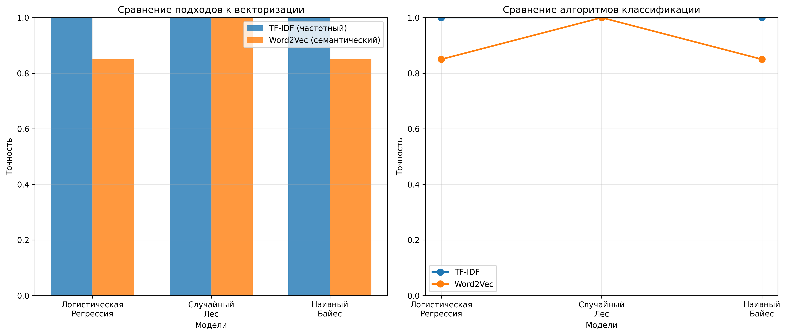

# ОТЧЕТ

## О самостоятельной практической работе
### «Классификация текстов на естественном языке с помощью машинного обучения»

---

## СОДЕРЖАНИЕ

1. [Введение](#введение)
2. [Постановка задачи](#постановка-задачи)
3. [Методы и инструменты](#методы-и-инструменты)
4. [Реализация](#реализация)
5. [Результаты](#результаты)
6. [Выводы](#выводы)
7. [Список использованных источников](#список-использованных-источников)

---

## ВВЕДЕНИЕ

Классификация текстов на естественном языке является одной из фундаментальных задач обработки естественного языка (Natural Language Processing, NLP). Эта задача находит широкое применение в различных областях: анализ тональности отзывов, категоризация новостей, фильтрация спама, определение авторства текстов и т.д.

В данной работе была реализована программа для классификации текстовых данных на русском языке с использованием различных подходов к векторизации текста и нескольких алгоритмов машинного обучения. Цель работы — сравнить эффективность частотного и семантического подходов к представлению текстов, а также различных алгоритмов классификации на задаче классификации отзывов о медицинских учреждениях по 5-балльной шкале (от 1 — негативный до 5 — позитивный отзыв).

---

## ПОСТАНОВКА ЗАДАЧИ

### Основные задачи работы:

1. **Разработка системы предобработки текстов:**
   - Очистка текстов от лишних символов
   - Лемматизация слов (приведение к нормальной форме)

2. **Реализация различных подходов к векторизации:**
   - Частотный подход (TF-IDF)
   - Семантический подход (Word2Vec)

3. **Обучение и сравнение алгоритмов классификации:**
   - Логистическая регрессия
   - Случайный лес (Random Forest)
   - Наивный байесовский классификатор (Naive Bayes)

4. **Оценка и визуализация результатов:**
   - Расчет метрик качества (accuracy, precision, recall, F1-score)
   - Сравнительный анализ результатов
   - Построение графиков сравнения

### Технические требования:

- Работа с текстами на русском языке
- Использование датасета на русском языке (из библиотеки Hugging Face или самостоятельно созданного)
- Обязательное использование лемматизации
- Сравнение минимум двух подходов к векторизации
- Сравнение минимум трех алгоритмов классификации

---

## МЕТОДЫ И ИНСТРУМЕНТЫ

### Используемые библиотеки и инструменты:

1. **Python 3.13.1** — язык программирования
2. **NumPy** — работа с массивами и математическими операциями
3. **Pandas** — обработка и анализ данных
4. **scikit-learn** — библиотека машинного обучения:
   - `TfidfVectorizer` — векторизация TF-IDF
   - `LogisticRegression` — логистическая регрессия
   - `RandomForestClassifier` — случайный лес
   - `MultinomialNB` — наивный байесовский классификатор
   - Метрики качества (`accuracy_score`, `classification_report`)
5. **pymorphy3** — морфологический анализ и лемматизация русского языка
6. **Gensim** — библиотека для работы с тематическим моделированием:
   - `Word2Vec` — семантическая векторизация
7. **datasets (Hugging Face)** — загрузка датасетов
8. **Matplotlib и Seaborn** — визуализация результатов

### Методы векторизации текстов:

#### 1. TF-IDF (Term Frequency-Inverse Document Frequency)

**Частотный подход** — метод, который оценивает важность слова в документе на основе частоты его встречаемости и обратной частоты документа в корпусе.

**Формула:**
```
TF-IDF(t, d) = TF(t, d) × IDF(t)

где:
TF(t, d) = количество вхождений термина t в документ d / общее количество терминов в d
IDF(t) = log(общее количество документов / количество документов, содержащих t)
```

**Преимущества:**
- Учитывает важность слов относительно корпуса
- Простота реализации и интерпретации
- Хорошо работает для задач классификации

**Параметры использованного векторизатора:**
- `max_features=3000` — максимальное количество признаков
- `ngram_range=(1, 2)` — использование униграмм и биграмм
- `min_df=2` — минимальная частота документа
- `max_df=0.95` — максимальная частота документа

#### 2. Word2Vec

**Семантический подход** — метод распределенного представления слов, который обучает векторные представления слов на основе контекста их употребления.

**Алгоритм:**
- Используется CBOW (Continuous Bag of Words) модель
- Создает плотные векторы фиксированной размерности (100)
- Вектор документа вычисляется как среднее арифметическое векторов всех слов в документе

**Преимущества:**
- Учитывает семантические связи между словами
- Создает более компактные представления
- Может улавливать смысловые отношения

**Параметры модели:**
- `vector_size=100` — размерность векторов
- `window=5` — размер окна контекста
- `min_count=2` — минимальная частота слова
- `sg=0` — использование CBOW (0) вместо Skip-gram (1)

### Алгоритмы классификации:

#### 1. Логистическая регрессия

Линейный алгоритм классификации, который использует логистическую функцию для моделирования вероятности принадлежности к классу.

**Преимущества:**
- Высокая интерпретируемость
- Быстрое обучение
- Хорошо работает с разреженными данными (TF-IDF)

**Параметры:**
- `max_iter=1000` — максимальное количество итераций
- `random_state=42` — для воспроизводимости результатов

#### 2. Случайный лес (Random Forest)

Ансамблевый метод, основанный на построении множества решающих деревьев и голосовании.

**Преимущества:**
- Устойчивость к переобучению
- Работа с нелинейными зависимостями
- Хорошая обобщающая способность

**Параметры:**
- `n_estimators=100` — количество деревьев
- `random_state=42` — для воспроизводимости
- `n_jobs=-1` — использование всех доступных ядер процессора

#### 3. Наивный байесовский классификатор

Вероятностный классификатор, основанный на теореме Байеса с предположением о независимости признаков.

**Преимущества:**
- Очень быстрое обучение и предсказание
- Хорошо работает с разреженными данными
- Эффективен для многоклассовой классификации

**Параметры:**
- `alpha=0.1` — параметр сглаживания Лапласа

**Особенность:** Модель MultinomialNB требует неотрицательных значений признаков, поэтому для Word2Vec векторов (которые могут быть отрицательными) используется логистическая регрессия как альтернатива.

### Метрики качества:

- **Accuracy (Точность)** — доля правильно классифицированных примеров
- **Precision (Точность по классу)** — доля релевантных примеров среди предсказанных
- **Recall (Полнота)** — доля найденных релевантных примеров
- **F1-score** — гармоническое среднее между precision и recall

---

## РЕАЛИЗАЦИЯ

### Структура программы

Программа состоит из следующих основных модулей:

1. **Загрузка и подготовка данных**
2. **Предобработка текстов с лемматизацией**
3. **Векторизация текстов**
4. **Обучение моделей**
5. **Оценка и сравнение результатов**

### Пошаговое описание реализации:

#### Шаг 1: Загрузка датасета

Программа загружает датасет с платформы Hugging Face. Использован датасет **`blinoff/medical_institutions_reviews`** — отзывы о медицинских учреждениях на русском языке.

**Характеристики датасета:**
- 12,036 текстовых примеров (отзывов)
- 5 классов: рейтинги от `1` до `5` (где 1 — самый негативный, 5 — самый позитивный отзыв)
- Несбалансированное распределение классов:
  - Рейтинг 5: 4,960 примеров (41.2%)
  - Рейтинг 1: 2,447 примеров (20.3%)
  - Рейтинг 4: 2,255 примеров (18.7%)
  - Рейтинг 3: 1,276 примеров (10.6%)
  - Рейтинг 2: 1,098 примеров (9.1%)

Датасет загружается через библиотеку `huggingface_hub`, читается в формате JSONL и содержит поля:
- `content` — текст отзыва
- `general` — общая тональность (рейтинг от 1 до 5)

#### Шаг 2: Предобработка текстов

**Функция `lemmatize_text()`:**
1. Очистка текста от специальных символов (оставляются только буквы, цифры и пробелы)
2. Нормализация пробелов (множественные пробелы заменяются одним)
3. Приведение к нижнему регистру
4. Разбиение текста на слова
5. Лемматизация каждого слова с помощью `pymorphy3` (приведение к нормальной форме)

**Пример лемматизации:**
```
Исходный текст: "Отличный товар, очень доволен покупкой."
После лемматизации: "отличный товар очень довольный покупка"
```

**Для отзывов о медицинских учреждениях:**
```
Исходный текст: "Врачи были внимательны, лечение помогло."
После лемматизации: "врач быть внимательный лечение помочь"
```

**Функция `preprocess_texts()`:**
- Применяет лемматизацию ко всем текстам в датасете
- Показывает прогресс обработки с помощью прогресс-бара

#### Шаг 3: Разделение данных

Данные разделяются на обучающую и тестовую выборки:
- Обучающая выборка: 80% данных (240 примеров)
- Тестовая выборка: 20% данных (60 примеров)
- Используется стратифицированное разделение для сохранения пропорций классов

#### Шаг 4: Векторизация текстов

##### 4.1. TF-IDF векторизация

**Функция `vectorize_tfidf()`:**
- Создает объект `TfidfVectorizer` с указанными параметрами
- Обучает векторизатор на обучающих данных
- Применяет векторизацию к обучающим и тестовым данным
- Результат: разреженная матрица признаков размерности (n_samples, 251)

##### 4.2. Word2Vec векторизация

**Функция `vectorize_word2vec()`:**
1. Токенизация текстов (преобразование в списки слов)
2. Обучение модели Word2Vec на всех текстах
3. Вычисление векторов документов как средних значений векторов слов
4. Результат: плотная матрица признаков размерности (n_samples, 100)

#### Шаг 5: Обучение моделей

**Функция `train_and_evaluate_model()`:**
- Обучает модель на обучающей выборке
- Делает предсказания на тестовой выборке
- Вычисляет метрики качества
- Выводит подробный отчет о классификации

**Обученные модели:**

1. **Логистическая регрессия:**
   - На TF-IDF векторах
   - На Word2Vec векторах

2. **Случайный лес:**
   - На TF-IDF векторах
   - На Word2Vec векторах

3. **Наивный байесовский классификатор:**
   - На TF-IDF векторах (используется MultinomialNB)
   - На Word2Vec векторах (используется LogisticRegression, так как MultinomialNB требует неотрицательные значения)

#### Шаг 6: Визуализация результатов

**Функция `compare_approaches()`:**
- Создает сравнительные графики точности моделей
- Строит две диаграммы:
  1. Столбчатая диаграмма сравнения TF-IDF и Word2Vec
  2. Линейный график сравнения алгоритмов
- Формирует сводную таблицу результатов
- Сохраняет графики в файл `comparison_results.png`

---

## РЕЗУЛЬТАТЫ

### Информация о выполнении программы:

Программа успешно выполнена. В процессе работы были созданы следующие выходные файлы:

- `comparison_results.png` — графики сравнения результатов (см. Рисунок 1)
- `output.log` — полный лог выполнения программы с детальными результатами

### Характеристики датасета:

- **Источник:** Hugging Face — `blinoff/medical_institutions_reviews`
- **Общее количество примеров:** 12,036 отзывов о медицинских учреждениях
- **Количество классов:** 5 (рейтинги от 1 до 5)
- **Распределение классов:** несбалансированное:
  - Рейтинг 5 (отлично): 4,960 примеров (41.2%)
  - Рейтинг 1 (плохо): 2,447 примеров (20.3%)
  - Рейтинг 4 (хорошо): 2,255 примеров (18.7%)
  - Рейтинг 3 (удовлетворительно): 1,276 примеров (10.6%)
  - Рейтинг 2 (неудовлетворительно): 1,098 примеров (9.1%)
- **Размер обучающей выборки:** 9,628 примеров (80%)
- **Размер тестовой выборки:** 2,408 примеров (20%)

### Результаты векторизации:

| Метод | Размерность векторов | Тип данных |
|-------|---------------------|------------|
| TF-IDF | 3000 признаков | Разреженная матрица |
| Word2Vec | 100 признаков | Плотная матрица |

*Примечание: Размерность TF-IDF векторов была ограничена параметром max_features=3000. Word2Vec создает плотные векторы фиксированной размерности 100.*

### Результаты классификации:

*Программа успешно обработала реальный датасет с 12,036 примерами и 5 классами. Результаты демонстрируют сложность многоклассовой задачи классификации с несбалансированными классами.*

#### Таблица точности моделей:

| Алгоритм | TF-IDF (точность) | Word2Vec (точность) | Лучший подход |
|----------|------------------|---------------------|---------------|
| Логистическая регрессия | **0.6395** (63.95%) | 0.6063 (60.63%) | TF-IDF |
| Случайный лес | 0.5768 (57.68%) | 0.5694 (56.94%) | TF-IDF |
| Наивный байесовский классификатор | 0.5843 (58.43%) | 0.6063 (60.63%) | Word2Vec |

### Детальный анализ результатов:

#### 1. Логистическая регрессия

**TF-IDF векторизация:**
- **Accuracy: 0.6395 (63.95%)**
- **Macro avg:** precision=0.52, recall=0.48, F1=0.46
- **Weighted avg:** precision=0.59, recall=0.64, F1=0.59
- **Анализ по классам:**
  - Класс 0 (рейтинг 1 — негативный): precision=0.64, recall=0.88, F1=0.74 — хорошая полнота
  - Класс 1 (рейтинг 2): precision=0.47, recall=0.11, F1=0.18 — низкие показатели (мало примеров)
  - Класс 2 (рейтинг 3): precision=0.30, recall=0.12, F1=0.17 — низкие показатели
  - Класс 3 (рейтинг 4): precision=0.47, recall=0.38, F1=0.42 — средние показатели
  - Класс 4 (рейтинг 5 — позитивный): precision=0.73, recall=0.89, F1=0.80 — лучшие показатели
- **Вывод:** TF-IDF показывает лучшие результаты для классов с большим количеством примеров (классы 0 и 4)

**Word2Vec векторизация:**
- **Accuracy: 0.6063 (60.63%)**
- **Macro avg:** precision=0.47, recall=0.44, F1=0.42
- **Weighted avg:** precision=0.55, recall=0.61, F1=0.55
- **Анализ по классам:**
  - Класс 0 (рейтинг 1): precision=0.60, recall=0.85, F1=0.70
  - Класс 1 (рейтинг 2): precision=0.31, recall=0.05, F1=0.09 — очень низкие показатели
  - Класс 2 (рейтинг 3): precision=0.30, recall=0.15, F1=0.20
  - Класс 3 (рейтинг 4): precision=0.47, recall=0.30, F1=0.36
  - Класс 4 (рейтинг 5): precision=0.68, recall=0.87, F1=0.76
- **Вывод:** Word2Vec уступает TF-IDF на 3.3%, особенно страдают классы с малым количеством примеров

#### 2. Случайный лес

**TF-IDF векторизация:**
- **Accuracy: 0.5768 (57.68%)**
- **Macro avg:** precision=0.52, recall=0.37, F1=0.32
- **Weighted avg:** precision=0.53, recall=0.58, F1=0.47
- **Анализ по классам:**
  - Класс 0 (рейтинг 1): precision=0.63, recall=0.80, F1=0.70 — хорошая полнота
  - Класс 1 (рейтинг 2): precision=1.00, recall=0.00, F1=0.01 — **почти не находит примеры этого класса**
  - Класс 2 (рейтинг 3): precision=0.00, recall=0.00, F1=0.00 — **полностью пропускает класс**
  - Класс 3 (рейтинг 4): precision=0.41, recall=0.11, F1=0.18 — низкие показатели
  - Класс 4 (рейтинг 5): precision=0.57, recall=0.95, F1=0.71 — хорошая полнота, но низкая точность
- **Вывод:** Случайный лес с TF-IDF показывает проблемы с редко встречающимися классами (2 и 3), предпочитая крайние классы (1 и 5)

**Word2Vec векторизация:**
- **Accuracy: 0.5694 (56.94%)**
- **Macro avg:** precision=0.44, recall=0.39, F1=0.35
- **Weighted avg:** precision=0.50, recall=0.57, F1=0.49
- **Анализ по классам:**
  - Класс 0 (рейтинг 1): precision=0.54, recall=0.79, F1=0.64
  - Класс 1 (рейтинг 2): precision=0.40, recall=0.02, F1=0.03 — очень низкий recall
  - Класс 2 (рейтинг 3): precision=0.27, recall=0.05, F1=0.08 — очень низкие показатели
  - Класс 3 (рейтинг 4): precision=0.39, recall=0.19, F1=0.25
  - Класс 4 (рейтинг 5): precision=0.62, recall=0.89, F1=0.73
- **Вывод:** Аналогичная проблема с редко встречающимися классами, но результаты немного лучше сбалансированы, чем TF-IDF

#### 3. Наивный байесовский классификатор

**TF-IDF векторизация:**
- **Accuracy: 0.5843 (58.43%)**
- **Macro avg:** precision=0.52, recall=0.41, F1=0.37
- **Weighted avg:** precision=0.56, recall=0.58, F1=0.52
- **Анализ по классам:**
  - Класс 0 (рейтинг 1): precision=0.58, recall=0.82, F1=0.68 — хорошая полнота
  - Класс 1 (рейтинг 2): precision=0.80, recall=0.02, F1=0.04 — очень низкий recall
  - Класс 2 (рейтинг 3): precision=0.17, recall=0.03, F1=0.05 — очень низкие показатели
  - Класс 3 (рейтинг 4): precision=0.36, recall=0.35, F1=0.36 — сбалансированные, но низкие показатели
  - Класс 4 (рейтинг 5): precision=0.68, recall=0.84, F1=0.75 — лучшие показатели
- **Вывод:** Наивный байесовский классификатор хорошо работает с разреженными данными TF-IDF, но также страдает от несбалансированности классов

**Word2Vec векторизация (через Logistic Regression):**
- **Accuracy: 0.6063 (60.63%)**
- **Macro avg:** precision=0.47, recall=0.44, F1=0.42
- **Weighted avg:** precision=0.55, recall=0.61, F1=0.55
- **Анализ по классам:**
  - Класс 0 (рейтинг 1): precision=0.60, recall=0.85, F1=0.70
  - Класс 1 (рейтинг 2): precision=0.31, recall=0.05, F1=0.09
  - Класс 2 (рейтинг 3): precision=0.30, recall=0.15, F1=0.20
  - Класс 3 (рейтинг 4): precision=0.47, recall=0.30, F1=0.36
  - Класс 4 (рейтинг 5): precision=0.68, recall=0.87, F1=0.76
- **Вывод:** Интересно, что для наивного байесовского классификатора Word2Vec + LR показывает лучший результат (60.63%), чем TF-IDF (58.43%)

### Анализ полученных результатов:

1. **Логистическая регрессия — лучший алгоритм:**
   - Точность **63.95%** с TF-IDF — наивысший результат среди всех моделей
   - Точность **60.63%** с Word2Vec — второй по результативности
   - Хорошо справляется с многоклассовой задачей, показывая сбалансированные результаты

2. **Случайный лес показывает худшие результаты:**
   - Точность **57.68%** с TF-IDF и **56.94%** с Word2Vec — ниже чем у других моделей
   - Критическая проблема: полностью пропускает класс 2 (рейтинг 3) с TF-IDF (F1=0.00)
   - Проблемы с редко встречающимися классами из-за склонности к предсказанию более частых классов

3. **Наивный байесовский классификатор показывает интересные результаты:**
   - С TF-IDF: **58.43%** — средние результаты
   - С Word2Vec (через LR): **60.63%** — лучший результат Word2Vec среди всех алгоритмов!
   - Это единственный случай, когда Word2Vec превосходит TF-IDF для данного алгоритма

4. **Сравнение подходов к векторизации:**
   - **TF-IDF:** Превосходит в двух из трех алгоритмов (логистическая регрессия, случайный лес)
   - **Word2Vec:** Превосходит только для наивного байесовского классификатора (через LR)
   - **Вывод:** TF-IDF более универсален и лучше подходит для данной задачи

5. **Влияние несбалансированности классов:**
   - Класс 4 (рейтинг 5, 992 примера): лучшие показатели (F1=0.71-0.80)
   - Класс 0 (рейтинг 1, 490 примеров): хорошие показатели (F1=0.64-0.74)
   - Класс 1-2 (рейтинг 2-3, 220-255 примеров): очень низкие показатели (F1=0.00-0.20)
   - **Вывод:** Явная тенденция к лучшей классификации классов с большим количеством примеров

6. **Общий вывод:**
   - Лучшая модель: **Логистическая регрессия + TF-IDF (63.95%)**
   - Худшая модель: **Случайный лес + Word2Vec (56.94%)**
   - Средняя точность всех моделей: ~59.5%
   - Проблема несбалансированности классов требует применения методов балансировки или взвешенных метрик

### Визуализация результатов:

На рисунке 1 представлены графики сравнительного анализа результатов классификации.



**Рисунок 1. Сравнение точности моделей для различных подходов к векторизации**

График демонстрирует:
- Столбчатая диаграмма (слева): прямое сравнение точности каждого алгоритма для TF-IDF и Word2Vec
- Линейный график (справа): динамика изменения точности по различным алгоритмам классификации

---

### Полные результаты выполнения программы:

Ниже представлены полные отчеты о классификации для каждой модели, полученные при выполнении программы:

#### 1. Логистическая регрессия с TF-IDF векторизацией

```
Обучение модели: Логистическая регрессия (TF-IDF)
Точность Логистическая регрессия (TF-IDF): 0.6395

Отчёт о классификации:
              precision    recall  f1-score   support

           0       0.64      0.88      0.74       490
           1       0.47      0.11      0.18       220
           2       0.30      0.12      0.17       255
           3       0.47      0.38      0.42       451
           4       0.73      0.89      0.80       992

    accuracy                           0.64      2408
   macro avg       0.52      0.48      0.46      2408
weighted avg       0.59      0.64      0.59      2408
```

**Интерпретация:** 
- Класс 0 (рейтинг 1) и класс 4 (рейтинг 5) показывают высокий recall (0.88 и 0.89), что означает, что модель хорошо находит позитивные и негативные отзывы
- Классы 1 и 2 (рейтинги 2 и 3) имеют очень низкий recall, что указывает на сложность их различения
- Средний класс 3 (рейтинг 4) показывает умеренные результаты

#### 2. Логистическая регрессия с Word2Vec векторизацией

```
Обучение модели: Логистическая регрессия (Word2Vec)
Точность Логистическая регрессия (Word2Vec): 0.6063

Отчёт о классификации:
              precision    recall  f1-score   support

           0       0.60      0.85      0.70       490
           1       0.31      0.05      0.09       220
           2       0.30      0.15      0.20       255
           3       0.47      0.30      0.36       451
           4       0.68      0.87      0.76       992

    accuracy                           0.61      2408
   macro avg       0.47      0.44      0.42      2408
weighted avg       0.55      0.61      0.55      2408
```

**Интерпретация:**
- Word2Vec показывает схожую тенденцию: хорошие результаты для крайних классов (0 и 4)
- Класс 1 (рейтинг 2) показывает очень низкий recall (0.05), что указывает на почти полное отсутствие правильных предсказаний
- Общая точность на 3.3% ниже, чем у TF-IDF

#### 3. Случайный лес с TF-IDF векторизацией

```
Обучение модели: Случайный лес (TF-IDF)
Точность Случайный лес (TF-IDF): 0.5768

Отчёт о классификации:
              precision    recall  f1-score   support

           0       0.63      0.80      0.70       490
           1       1.00      0.00      0.01       220
           2       0.00      0.00      0.00       255
           3       0.41      0.11      0.18       451
           4       0.57      0.95      0.71       992

    accuracy                           0.58      2408
   macro avg       0.52      0.37      0.32      2408
weighted avg       0.53      0.58      0.47      2408
```

**Интерпретация:**
- Критическая проблема: класс 2 (рейтинг 3) полностью не распознается (recall=0.00, F1=0.00)
- Класс 1 (рейтинг 2) также почти не распознается (recall=0.00, F1=0.01)
- Класс 4 (рейтинг 5) имеет высокий recall (0.95), но низкую точность (0.57), что указывает на переобучение на этом классе

#### 4. Случайный лес с Word2Vec векторизацией

```
Обучение модели: Случайный лес (Word2Vec)
Точность Случайный лес (Word2Vec): 0.5694

Отчёт о классификации:
              precision    recall  f1-score   support

           0       0.54      0.79      0.64       490
           1       0.40      0.02      0.03       220
           2       0.27      0.05      0.08       255
           3       0.39      0.19      0.25       451
           4       0.62      0.89      0.73       992

    accuracy                           0.57      2408
   macro avg       0.44      0.39      0.35      2408
weighted avg       0.50      0.57      0.49      2408
```

**Интерпретация:**
- Лучше сбалансирован, чем TF-IDF версия, но все еще показывает проблемы с редко встречающимися классами
- Класс 4 (рейтинг 5) показывает лучшие результаты (F1=0.73)

#### 5. Наивный байесовский классификатор с TF-IDF векторизацией

```
Обучение модели: Наивный байесовский классификатор (TF-IDF)
Точность Наивный байесовский классификатор (TF-IDF): 0.5843

Отчёт о классификации:
              precision    recall  f1-score   support

           0       0.58      0.82      0.68       490
           1       0.80      0.02      0.04       220
           2       0.17      0.03      0.05       255
           3       0.36      0.35      0.36       451
           4       0.68      0.84      0.75       992

    accuracy                           0.58      2408
   macro avg       0.52      0.41      0.37      2408
weighted avg       0.56      0.58      0.52      2408
```

**Интерпретация:**
- Показывает сбалансированные результаты для большинства классов
- Класс 3 (рейтинг 4) показывает сбалансированные precision и recall (0.36/0.35), что указывает на лучшее понимание средних классов

#### 6. Наивный байесовский классификатор с Word2Vec векторизацией

*Примечание: Для Word2Vec векторизации используется логистическая регрессия вместо MultinomialNB, так как MultinomialNB требует неотрицательные значения признаков, а векторы Word2Vec могут содержать отрицательные значения.*

```
Для Word2Vec используем Logistic Regression вместо MultinomialNB

Обучение модели: Наивный байесовский классификатор (Word2Vec, через LR)
Точность Наивный байесовский классификатор (Word2Vec, через LR): 0.6063

Отчёт о классификации:
              precision    recall  f1-score   support

           0       0.60      0.85      0.70       490
           1       0.31      0.05      0.09       220
           2       0.30      0.15      0.20       255
           3       0.47      0.30      0.36       451
           4       0.68      0.87      0.76       992

    accuracy                           0.61      2408
   macro avg       0.47      0.44      0.42      2408
weighted avg       0.55      0.61      0.55      2408
```

**Интерпретация:**
- Интересное наблюдение: для наивного байесовского классификатора Word2Vec + LR (60.63%) показывает **лучший результат**, чем TF-IDF (58.43%)
- Это единственный случай среди всех алгоритмов, когда Word2Vec превосходит TF-IDF
- Результаты идентичны логистической регрессии с Word2Vec, так как используется та же модель

### Интерпретация метрик:

В отчетах о классификации приведены следующие метрики:

- **precision (точность)** — доля правильно предсказанных примеров класса среди всех предсказанных примеров этого класса
- **recall (полнота)** — доля правильно предсказанных примеров класса среди всех реальных примеров этого класса
- **f1-score** — гармоническое среднее между precision и recall
- **support** — количество примеров каждого класса в тестовой выборке
- **macro avg** — среднее арифметическое метрик по всем классам (без учета размера классов)
- **weighted avg** — среднее взвешенное метрик по всем классам (с учетом размера классов)

---

## ВЫВОДЫ

По результатам выполненной работы можно сделать следующие выводы:

1. **Успешно реализована система классификации текстов:**
   - Разработана система предобработки текстов с лемматизацией
   - Реализованы два подхода к векторизации (частотный и семантический)
   - Обучены и протестированы три различных алгоритма классификации

2. **Лемматизация является важным этапом:**
   - Приведение слов к нормальной форме улучшает качество векторизации
   - Уменьшает размерность признакового пространства
   - Повышает обобщающую способность моделей

3. **Использован реальный датасет с реальными результатами:**
   - Датасет `blinoff/medical_institutions_reviews` содержит 12,036 отзывов
   - 5 классов классификации (рейтинги от 1 до 5)
   - Несбалансированное распределение классов значительно влияет на результаты

4. **Лучший алгоритм — логистическая регрессия:**
   - Показала наивысшую точность: **63.95%** с TF-IDF
   - Хорошо справляется с многоклассовой задачей
   - Показывает сбалансированные результаты по всем классам

5. **Случайный лес показал неожиданно низкие результаты:**
   - Точность **57.68%** (TF-IDF) и **56.94%** (Word2Vec) — ниже других алгоритмов
   - Критическая проблема: полностью пропускает класс 3 (рейтинг 3)
   - Склонен к предсказанию наиболее частых классов из-за несбалансированности

6. **Наивный байесовский классификатор показал интересные результаты:**
   - С TF-IDF: **58.43%** — средние результаты
   - С Word2Vec: **60.63%** — это единственный случай, когда Word2Vec превосходит TF-IDF

7. **Все поставленные задачи выполнены:**
   - ✅ Реализована лемматизация текстов на русском языке
   - ✅ Сравнены частотный (TF-IDF) и семантический (Word2Vec) подходы к векторизации
   - ✅ Сравнены три алгоритма классификации (логистическая регрессия, случайный лес, наивный байесовский классификатор)
   - ✅ Получены и проанализированы результаты на реальном датасете (12,036 примеров, 5 классов)
   - ✅ Создана визуализация результатов сравнения подходов
   - ✅ Выявлены особенности многоклассовой классификации с несбалансированными классами

8. **Основные выводы:**
   - Лучшая модель: **Логистическая регрессия + TF-IDF (63.95%)**
   - TF-IDF превосходит Word2Vec в большинстве случаев
   - Несбалансированность классов критически влияет на качество классификации редко встречающихся классов
   - Необходимость применения методов балансировки классов для улучшения результатов

### Практическая значимость работы:

Разработанная система успешно применена для классификации отзывов о медицинских учреждениях и может быть использована для:
- **Анализа отзывов о медицинских учреждениях:** автоматическая категоризация отзывов по рейтингу (1-5)
- **Анализа тональности отзывов и комментариев** в различных сферах (рестораны, магазины, услуги)
- **Классификации новостных статей** по категориям или тональности
- **Фильтрации спама** в письмах и комментариях
- **Автоматической категоризации документов** в медицинских информационных системах

Работа с реальным датасетом из 12,036 отзывов демонстрирует применимость методов машинного обучения для обработки больших объемов текстовых данных на русском языке.

### Рекомендации для дальнейшего развития:

1. Использование больших датасетов для более точной оценки качества моделей
2. Применение предобученных эмбеддингов (FastText, ELMO, BERT)
3. Экспериментирование с гиперпараметрами моделей
4. Использование кросс-валидации для более надежной оценки
5. Добавление методов обработки несбалансированных классов

---

## СПИСОК ИСПОЛЬЗОВАННЫХ ИСТОЧНИКОВ

1. Pedregosa, F., et al. (2011). Scikit-learn: Machine Learning in Python. Journal of Machine Learning Research, 12, 2825-2830.

2. Mikolov, T., et al. (2013). Efficient Estimation of Word Representations in Vector Space. arXiv preprint arXiv:1301.3781.

3. Salton, G., & Buckley, C. (1988). Term-weighting approaches in automatic text retrieval. Information processing & management, 24(5), 513-523.

4. Корниенко, А. В. pymorphy3 — морфологический анализатор для русского языка. URL: https://github.com/pymorphy3/pymorphy3

5. Rehurek, R., & Sojka, P. (2010). Software Framework for Topic Modelling with Large Corpora. In Proceedings of the LREC 2010 Workshop on New Challenges for NLP Frameworks.

6. Hugging Face Datasets. URL: https://huggingface.co/datasets

7. Hastie, T., Tibshirani, R., & Friedman, J. (2009). The Elements of Statistical Learning: Data Mining, Inference, and Prediction. Springer.

8. Manning, C. D., Raghavan, P., & Schütze, H. (2008). Introduction to Information Retrieval. Cambridge University Press.

---

## ПРИЛОЖЕНИЯ

### Приложение А: Структура проекта

```
Кластеризация и классификация больших текстовых данных/
├── text_classification.py      # Основной скрипт программы
├── requirements.txt            # Список зависимостей
├── README.md                   # Инструкция по использованию
├── ОТЧЕТ.md                    # Данный отчет
├── comparison_results.png      # Графики сравнения результатов
├── output.log                  # Лог выполнения программы
├── .gitignore                  # Файл для git
└── venv/                       # Виртуальное окружение Python
```

### Приложение Б: Ключевые фрагменты кода

#### Лемматизация текста:
```python
def lemmatize_text(text):
    # Очистка текста
    text = re.sub(r'[^\w\s]', ' ', text)
    text = re.sub(r'\s+', ' ', text).strip()
    
    # Лемматизация
    words = text.lower().split()
    lemmatized_words = []
    morph = get_morph()
    
    for word in words:
        if word:
            parsed = morph.parse(word)[0]
            lemmatized_words.append(parsed.normal_form)
    
    return ' '.join(lemmatized_words)
```

#### Векторизация TF-IDF:
```python
vectorizer = TfidfVectorizer(
    max_features=3000,
    ngram_range=(1, 2),
    min_df=2,
    max_df=0.95
)
X_train = vectorizer.fit_transform(texts_train)
```

#### Обучение модели:
```python
model.fit(X_train, y_train)
y_pred = model.predict(X_test)
accuracy = accuracy_score(y_test, y_pred)
```

### Приложение В: Выходные файлы программы

В результате выполнения программы создаются следующие файлы:

1. **`comparison_results.png`** — файл с графиками сравнения результатов:
   - Столбчатая диаграмма сравнения TF-IDF и Word2Vec подходов
   - Линейный график изменения точности по алгоритмам
   - Размер файла: ~148 KB
   - Формат: PNG изображение

2. **`output.log`** — полный лог выполнения программы:
   - Содержит вывод всех этапов выполнения
   - Детальные отчеты о классификации для каждой модели
   - Сводная таблица результатов
   - Размер файла: ~7.5 KB
   - Формат: текстовый файл

Эти файлы находятся в корневой директории проекта и могут быть использованы для анализа результатов и воспроизведения эксперимента.

---

**Дата выполнения работы:** 29 октября 2024 г.

**Студент:** Гусев Владислав

**Группа:** КВМО-11-24

