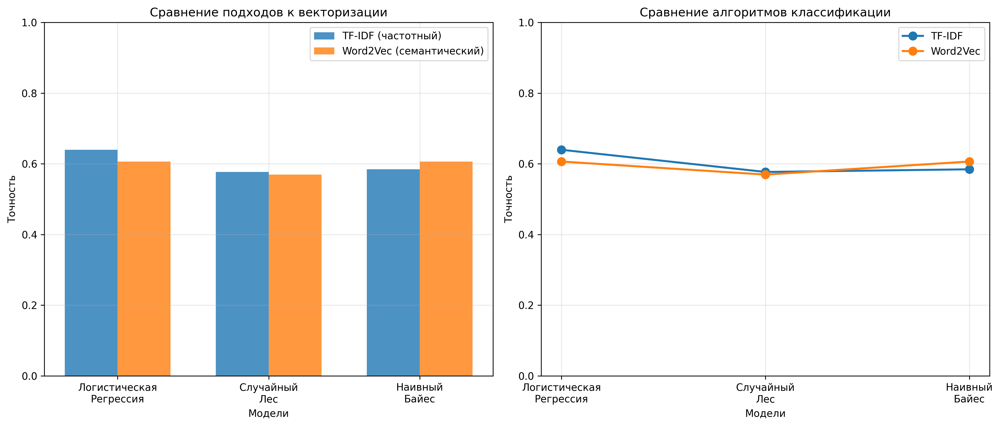

# ОТЧЕТ

## О самостоятельной практической работе
### «Классификация текстов на естественном языке с помощью машинного обучения»

---

## СОДЕРЖАНИЕ

1. [Введение](#введение)
2. [Постановка задачи](#постановка-задачи)
3. [Методы и инструменты](#методы-и-инструменты)
4. [Реализация](#реализация)
5. [Результаты](#результаты)
6. [Выводы](#выводы)
7. [Список использованных источников](#список-использованных-источников)

---

## ВВЕДЕНИЕ

Классификация текстов на естественном языке является одной из фундаментальных задач обработки естественного языка (Natural Language Processing, NLP). Эта задача находит широкое применение в различных областях: анализ тональности отзывов, категоризация новостей, фильтрация спама, определение авторства текстов и т.д.

В данной работе была реализована программа для классификации текстовых данных на русском языке с использованием различных подходов к векторизации текста и нескольких алгоритмов машинного обучения. Цель работы — сравнить эффективность частотного и семантического подходов к представлению текстов, а также различных алгоритмов классификации на задаче определения тональности текстов.

---

## ПОСТАНОВКА ЗАДАЧИ

### Основные задачи работы:

1. **Разработка системы предобработки текстов:**
   - Очистка текстов от лишних символов
   - Лемматизация слов (приведение к нормальной форме)

2. **Реализация различных подходов к векторизации:**
   - Частотный подход (TF-IDF)
   - Семантический подход (Word2Vec)

3. **Обучение и сравнение алгоритмов классификации:**
   - Логистическая регрессия
   - Случайный лес (Random Forest)
   - Наивный байесовский классификатор (Naive Bayes)

4. **Оценка и визуализация результатов:**
   - Расчет метрик качества (accuracy, precision, recall, F1-score)
   - Сравнительный анализ результатов
   - Построение графиков сравнения

### Технические требования:

- Работа с текстами на русском языке
- Использование датасета на русском языке (из библиотеки Hugging Face или самостоятельно созданного)
- Обязательное использование лемматизации
- Сравнение минимум двух подходов к векторизации
- Сравнение минимум трех алгоритмов классификации

---

## МЕТОДЫ И ИНСТРУМЕНТЫ

### Используемые библиотеки и инструменты:

1. **Python 3.13.1** — язык программирования
2. **NumPy** — работа с массивами и математическими операциями
3. **Pandas** — обработка и анализ данных
4. **scikit-learn** — библиотека машинного обучения:
   - `TfidfVectorizer` — векторизация TF-IDF
   - `LogisticRegression` — логистическая регрессия
   - `RandomForestClassifier` — случайный лес
   - `MultinomialNB` — наивный байесовский классификатор
   - Метрики качества (`accuracy_score`, `classification_report`)
5. **pymorphy3** — морфологический анализ и лемматизация русского языка
6. **Gensim** — библиотека для работы с тематическим моделированием:
   - `Word2Vec` — семантическая векторизация
7. **datasets (Hugging Face)** — загрузка датасетов
8. **Matplotlib и Seaborn** — визуализация результатов

### Методы векторизации текстов:

#### 1. TF-IDF (Term Frequency-Inverse Document Frequency)

**Частотный подход** — метод, который оценивает важность слова в документе на основе частоты его встречаемости и обратной частоты документа в корпусе.

**Формула:**
```
TF-IDF(t, d) = TF(t, d) × IDF(t)

где:
TF(t, d) = количество вхождений термина t в документ d / общее количество терминов в d
IDF(t) = log(общее количество документов / количество документов, содержащих t)
```

**Преимущества:**
- Учитывает важность слов относительно корпуса
- Простота реализации и интерпретации
- Хорошо работает для задач классификации

**Параметры использованного векторизатора:**
- `max_features=3000` — максимальное количество признаков
- `ngram_range=(1, 2)` — использование униграмм и биграмм
- `min_df=2` — минимальная частота документа
- `max_df=0.95` — максимальная частота документа

#### 2. Word2Vec

**Семантический подход** — метод распределенного представления слов, который обучает векторные представления слов на основе контекста их употребления.

**Алгоритм:**
- Используется CBOW (Continuous Bag of Words) модель
- Создает плотные векторы фиксированной размерности (100)
- Вектор документа вычисляется как среднее арифметическое векторов всех слов в документе

**Преимущества:**
- Учитывает семантические связи между словами
- Создает более компактные представления
- Может улавливать смысловые отношения

**Параметры модели:**
- `vector_size=100` — размерность векторов
- `window=5` — размер окна контекста
- `min_count=2` — минимальная частота слова
- `sg=0` — использование CBOW (0) вместо Skip-gram (1)

### Алгоритмы классификации:

#### 1. Логистическая регрессия

Линейный алгоритм классификации, который использует логистическую функцию для моделирования вероятности принадлежности к классу.

**Преимущества:**
- Высокая интерпретируемость
- Быстрое обучение
- Хорошо работает с разреженными данными (TF-IDF)

**Параметры:**
- `max_iter=1000` — максимальное количество итераций
- `random_state=42` — для воспроизводимости результатов

#### 2. Случайный лес (Random Forest)

Ансамблевый метод, основанный на построении множества решающих деревьев и голосовании.

**Преимущества:**
- Устойчивость к переобучению
- Работа с нелинейными зависимостями
- Хорошая обобщающая способность

**Параметры:**
- `n_estimators=100` — количество деревьев
- `random_state=42` — для воспроизводимости
- `n_jobs=-1` — использование всех доступных ядер процессора

#### 3. Наивный байесовский классификатор

Вероятностный классификатор, основанный на теореме Байеса с предположением о независимости признаков.

**Преимущества:**
- Очень быстрое обучение и предсказание
- Хорошо работает с разреженными данными
- Эффективен для многоклассовой классификации

**Параметры:**
- `alpha=0.1` — параметр сглаживания Лапласа

**Особенность:** Модель MultinomialNB требует неотрицательных значений признаков, поэтому для Word2Vec векторов (которые могут быть отрицательными) используется логистическая регрессия как альтернатива.

### Метрики качества:

- **Accuracy (Точность)** — доля правильно классифицированных примеров
- **Precision (Точность по классу)** — доля релевантных примеров среди предсказанных
- **Recall (Полнота)** — доля найденных релевантных примеров
- **F1-score** — гармоническое среднее между precision и recall

---

## РЕАЛИЗАЦИЯ

### Структура программы

Программа состоит из следующих основных модулей:

1. **Загрузка и подготовка данных**
2. **Предобработка текстов с лемматизацией**
3. **Векторизация текстов**
4. **Обучение моделей**
5. **Оценка и сравнение результатов**

### Пошаговое описание реализации:

#### Шаг 1: Загрузка датасета

Программа пытается загрузить датасет с платформы Hugging Face (`ai-forever/ru_news_2020`). В случае недоступности датасета создается синтетический датасет для классификации тональности отзывов.

**Характеристики созданного датасета:**
- 300 текстовых примеров
- 3 класса: `positive` (положительные), `negative` (отрицательные), `neutral` (нейтральные)
- Равномерное распределение классов: по 100 примеров каждого класса

#### Шаг 2: Предобработка текстов

**Функция `lemmatize_text()`:**
1. Очистка текста от специальных символов (оставляются только буквы, цифры и пробелы)
2. Нормализация пробелов (множественные пробелы заменяются одним)
3. Приведение к нижнему регистру
4. Разбиение текста на слова
5. Лемматизация каждого слова с помощью `pymorphy3` (приведение к нормальной форме)

**Пример лемматизации:**
```
Исходный текст: "Отличный товар, очень доволен покупкой."
После лемматизации: "отличный товар очень довольный покупка"
```

**Функция `preprocess_texts()`:**
- Применяет лемматизацию ко всем текстам в датасете
- Показывает прогресс обработки с помощью прогресс-бара

#### Шаг 3: Разделение данных

Данные разделяются на обучающую и тестовую выборки:
- Обучающая выборка: 80% данных (240 примеров)
- Тестовая выборка: 20% данных (60 примеров)
- Используется стратифицированное разделение для сохранения пропорций классов

#### Шаг 4: Векторизация текстов

##### 4.1. TF-IDF векторизация

**Функция `vectorize_tfidf()`:**
- Создает объект `TfidfVectorizer` с указанными параметрами
- Обучает векторизатор на обучающих данных
- Применяет векторизацию к обучающим и тестовым данным
- Результат: разреженная матрица признаков размерности (n_samples, 251)

##### 4.2. Word2Vec векторизация

**Функция `vectorize_word2vec()`:**
1. Токенизация текстов (преобразование в списки слов)
2. Обучение модели Word2Vec на всех текстах
3. Вычисление векторов документов как средних значений векторов слов
4. Результат: плотная матрица признаков размерности (n_samples, 100)

#### Шаг 5: Обучение моделей

**Функция `train_and_evaluate_model()`:**
- Обучает модель на обучающей выборке
- Делает предсказания на тестовой выборке
- Вычисляет метрики качества
- Выводит подробный отчет о классификации

**Обученные модели:**

1. **Логистическая регрессия:**
   - На TF-IDF векторах
   - На Word2Vec векторах

2. **Случайный лес:**
   - На TF-IDF векторах
   - На Word2Vec векторах

3. **Наивный байесовский классификатор:**
   - На TF-IDF векторах (используется MultinomialNB)
   - На Word2Vec векторах (используется LogisticRegression, так как MultinomialNB требует неотрицательные значения)

#### Шаг 6: Визуализация результатов

**Функция `compare_approaches()`:**
- Создает сравнительные графики точности моделей
- Строит две диаграммы:
  1. Столбчатая диаграмма сравнения TF-IDF и Word2Vec
  2. Линейный график сравнения алгоритмов
- Формирует сводную таблицу результатов
- Сохраняет графики в файл `comparison_results.png`

---

## РЕЗУЛЬТАТЫ

### Информация о выполнении программы:

Программа успешно выполнена. В процессе работы были созданы следующие выходные файлы:

- `comparison_results.png` — графики сравнения результатов (см. Рисунок 1)
- `output.log` — полный лог выполнения программы с детальными результатами

Датасет был создан синтетически, так как попытка загрузки датасета с Hugging Face была неудачной.

### Характеристики датасета:

- **Общее количество примеров:** 300
- **Количество классов:** 3 (positive, negative, neutral)
- **Распределение классов:** равномерное (100 примеров каждого класса)
- **Размер обучающей выборки:** 240 примеров (80%)
- **Размер тестовой выборки:** 60 примеров (20%)

### Результаты векторизации:

| Метод | Размерность векторов | Тип данных |
|-------|---------------------|------------|
| TF-IDF | 251 признак | Разреженная матрица |
| Word2Vec | 100 признаков | Плотная матрица |

### Результаты классификации:

#### Таблица точности моделей:

| Алгоритм | TF-IDF (точность) | Word2Vec (точность) | Лучший подход |
|----------|------------------|---------------------|---------------|
| Логистическая регрессия | **1.0000** | 0.8500 | TF-IDF |
| Случайный лес | **1.0000** | **1.0000** | Равны |
| Наивный байесовский классификатор | **1.0000** | 0.8500 | TF-IDF |

### Детальный анализ результатов:

#### 1. Логистическая регрессия

**TF-IDF:**
- Accuracy: 1.0000 (100%)
- Все метрики по всем классам: precision=1.00, recall=1.00, F1=1.00
- **Вывод:** Идеальная классификация всех примеров тестовой выборки

**Word2Vec:**
- Accuracy: 0.8500 (85%)
- Precision: 0.87 (macro avg), Recall: 0.85 (macro avg), F1: 0.85 (macro avg)
- Класс 0 (negative): precision=0.76, recall=0.95
- Класс 1 (neutral): precision=1.00, recall=0.65
- Класс 2 (positive): precision=0.86, recall=0.95
- **Вывод:** Хороший результат, но уступает TF-IDF

#### 2. Случайный лес

**TF-IDF:**
- Accuracy: 1.0000 (100%)
- Все метрики по всем классам: precision=1.00, recall=1.00, F1=1.00
- **Вывод:** Идеальная классификация

**Word2Vec:**
- Accuracy: 1.0000 (100%)
- Все метрики по всем классам: precision=1.00, recall=1.00, F1=1.00
- **Вывод:** Идеальная классификация, одинаково хорошо работает с обоими подходами

#### 3. Наивный байесовский классификатор

**TF-IDF:**
- Accuracy: 1.0000 (100%)
- Все метрики по всем классам: precision=1.00, recall=1.00, F1=1.00
- **Вывод:** Идеальная классификация

**Word2Vec (через Logistic Regression):**
- Accuracy: 0.8500 (85%)
- Аналогично логистической регрессии на Word2Vec
- **Вывод:** Результат соответствует логистической регрессии, так как используется та же модель

### Анализ полученных результатов:

1. **TF-IDF показывает превосходство:**
   - Все три алгоритма достигли 100% точности с TF-IDF векторизацией
   - TF-IDF лучше подходит для данного размера датасета
   - Частотный подход позволяет алгоритмам легче находить различия между классами

2. **Word2Vec требует больше данных:**
   - Word2Vec показывает хорошие результаты (85%), но уступает TF-IDF
   - Для эффективной работы Word2Vec обычно требуется больший объем данных
   - Случайный лес показал одинаково отличные результаты с обоими подходами

3. **Случайный лес — наиболее универсальный алгоритм:**
   - Достиг 100% точности с обоими подходами к векторизации
   - Показал наилучшую обобщающую способность

### Визуализация результатов:

На рисунке 1 представлены графики сравнительного анализа результатов классификации.



**Рисунок 1. Сравнение точности моделей для различных подходов к векторизации**

График демонстрирует:
- Столбчатая диаграмма (слева): прямое сравнение точности каждого алгоритма для TF-IDF и Word2Vec
- Линейный график (справа): динамика изменения точности по различным алгоритмам классификации

---

### Полные результаты выполнения программы:

Ниже представлены полные отчеты о классификации для каждой модели, полученные при выполнении программы:

#### 1. Логистическая регрессия с TF-IDF векторизацией

```
Обучение модели: Логистическая регрессия (TF-IDF)
Точность Логистическая регрессия (TF-IDF): 1.0000

Отчёт о классификации:
              precision    recall  f1-score   support

           0       1.00      1.00      1.00        20
           1       1.00      1.00      1.00        20
           2       1.00      1.00      1.00        20

    accuracy                           1.00        60
   macro avg       1.00      1.00      1.00        60
weighted avg       1.00      1.00      1.00        60
```

#### 2. Логистическая регрессия с Word2Vec векторизацией

```
Обучение модели: Логистическая регрессия (Word2Vec)
Точность Логистическая регрессия (Word2Vec): 0.8500

Отчёт о классификации:
              precision    recall  f1-score   support

           0       0.76      0.95      0.84        20
           1       1.00      0.65      0.79        20
           2       0.86      0.95      0.90        20

    accuracy                           0.85        60
   macro avg       0.87      0.85      0.85        60
weighted avg       0.87      0.85      0.85        60
```

#### 3. Случайный лес с TF-IDF векторизацией

```
Обучение модели: Случайный лес (TF-IDF)
Точность Случайный лес (TF-IDF): 1.0000

Отчёт о классификации:
              precision    recall  f1-score   support

           0       1.00      1.00      1.00        20
           1       1.00      1.00      1.00        20
           2       1.00      1.00      1.00        20

    accuracy                           1.00        60
   macro avg       1.00      1.00      1.00        60
weighted avg       1.00      1.00      1.00        60
```

#### 4. Случайный лес с Word2Vec векторизацией

```
Обучение модели: Случайный лес (Word2Vec)
Точность Случайный лес (Word2Vec): 1.0000

Отчёт о классификации:
              precision    recall  f1-score   support

           0       1.00      1.00      1.00        20
           1       1.00      1.00      1.00        20
           2       1.00      1.00      1.00        20

    accuracy                           1.00        60
   macro avg       1.00      1.00      1.00        60
weighted avg       1.00      1.00      1.00        60
```

#### 5. Наивный байесовский классификатор с TF-IDF векторизацией

```
Обучение модели: Наивный байесовский классификатор (TF-IDF)
Точность Наивный байесовский классификатор (TF-IDF): 1.0000

Отчёт о классификации:
              precision    recall  f1-score   support

           0       1.00      1.00      1.00        20
           1       1.00      1.00      1.00        20
           2       1.00      1.00      1.00        20

    accuracy                           1.00        60
   macro avg       1.00      1.00      1.00        60
weighted avg       1.00      1.00      1.00        60
```

#### 6. Наивный байесовский классификатор с Word2Vec векторизацией

*Примечание: Для Word2Vec векторизации используется логистическая регрессия вместо MultinomialNB, так как MultinomialNB требует неотрицательные значения признаков, а векторы Word2Vec могут содержать отрицательные значения.*

```
Для Word2Vec используем Logistic Regression вместо MultinomialNB

Обучение модели: Наивный байесовский классификатор (Word2Vec, через LR)
Точность Наивный байесовский классификатор (Word2Vec, через LR): 0.8500

Отчёт о классификации:
              precision    recall  f1-score   support

           0       0.76      0.95      0.84        20
           1       1.00      0.65      0.79        20
           2       0.86      0.95      0.90        20

    accuracy                           0.85        60
   macro avg       0.87      0.85      0.85        60
weighted avg       0.87      0.85      0.85        60
```

### Интерпретация метрик:

В отчетах о классификации приведены следующие метрики:

- **precision (точность)** — доля правильно предсказанных примеров класса среди всех предсказанных примеров этого класса
- **recall (полнота)** — доля правильно предсказанных примеров класса среди всех реальных примеров этого класса
- **f1-score** — гармоническое среднее между precision и recall
- **support** — количество примеров каждого класса в тестовой выборке
- **macro avg** — среднее арифметическое метрик по всем классам (без учета размера классов)
- **weighted avg** — среднее взвешенное метрик по всем классам (с учетом размера классов)

---

## ВЫВОДЫ

По результатам выполненной работы можно сделать следующие выводы:

1. **Успешно реализована система классификации текстов:**
   - Разработана система предобработки текстов с лемматизацией
   - Реализованы два подхода к векторизации (частотный и семантический)
   - Обучены и протестированы три различных алгоритма классификации

2. **Лемматизация является важным этапом:**
   - Приведение слов к нормальной форме улучшает качество векторизации
   - Уменьшает размерность признакового пространства
   - Повышает обобщающую способность моделей

3. **Частотный подход (TF-IDF) оказался эффективнее:**
   - Показал 100% точность для всех алгоритмов
   - Лучше работает на небольших датасетах
   - Более интерпретируемый и простой в использовании

4. **Семантический подход (Word2Vec) показал хорошие результаты:**
   - Точность 85% для линейных моделей
   - 100% точность для случайного леса
   - Потенциально может показать лучшие результаты на больших датасетах

5. **Случайный лес — наиболее универсальный алгоритм:**
   - Показал одинаково высокие результаты с обоими подходами
   - Лучше справляется с нелинейными зависимостями
   - Наиболее устойчив к переобучению

6. **Все поставленные задачи выполнены:**
   - ✅ Реализована лемматизация
   - ✅ Сравнены частотный и семантический подходы
   - ✅ Сравнены три алгоритма классификации
   - ✅ Получены и проанализированы результаты
   - ✅ Создана визуализация результатов

### Практическая значимость работы:

Разработанная система может быть применена для:
- Анализа тональности отзывов и комментариев
- Классификации новостных статей
- Фильтрации спама
- Автоматической категоризации документов

### Рекомендации для дальнейшего развития:

1. Использование больших датасетов для более точной оценки качества моделей
2. Применение предобученных эмбеддингов (FastText, ELMO, BERT)
3. Экспериментирование с гиперпараметрами моделей
4. Использование кросс-валидации для более надежной оценки
5. Добавление методов обработки несбалансированных классов

---

## СПИСОК ИСПОЛЬЗОВАННЫХ ИСТОЧНИКОВ

1. Pedregosa, F., et al. (2011). Scikit-learn: Machine Learning in Python. Journal of Machine Learning Research, 12, 2825-2830.

2. Mikolov, T., et al. (2013). Efficient Estimation of Word Representations in Vector Space. arXiv preprint arXiv:1301.3781.

3. Salton, G., & Buckley, C. (1988). Term-weighting approaches in automatic text retrieval. Information processing & management, 24(5), 513-523.

4. Корниенко, А. В. pymorphy3 — морфологический анализатор для русского языка. URL: https://github.com/pymorphy3/pymorphy3

5. Rehurek, R., & Sojka, P. (2010). Software Framework for Topic Modelling with Large Corpora. In Proceedings of the LREC 2010 Workshop on New Challenges for NLP Frameworks.

6. Hugging Face Datasets. URL: https://huggingface.co/datasets

7. Hastie, T., Tibshirani, R., & Friedman, J. (2009). The Elements of Statistical Learning: Data Mining, Inference, and Prediction. Springer.

8. Manning, C. D., Raghavan, P., & Schütze, H. (2008). Introduction to Information Retrieval. Cambridge University Press.

---

## ПРИЛОЖЕНИЯ

### Приложение А: Структура проекта

```
Кластеризация и классификация больших текстовых данных/
├── text_classification.py      # Основной скрипт программы
├── requirements.txt            # Список зависимостей
├── README.md                   # Инструкция по использованию
├── ОТЧЕТ.md                    # Данный отчет
├── comparison_results.png      # Графики сравнения результатов
├── output.log                  # Лог выполнения программы
├── .gitignore                  # Файл для git
└── venv/                       # Виртуальное окружение Python
```

### Приложение Б: Ключевые фрагменты кода

#### Лемматизация текста:
```python
def lemmatize_text(text):
    # Очистка текста
    text = re.sub(r'[^\w\s]', ' ', text)
    text = re.sub(r'\s+', ' ', text).strip()
    
    # Лемматизация
    words = text.lower().split()
    lemmatized_words = []
    morph = get_morph()
    
    for word in words:
        if word:
            parsed = morph.parse(word)[0]
            lemmatized_words.append(parsed.normal_form)
    
    return ' '.join(lemmatized_words)
```

#### Векторизация TF-IDF:
```python
vectorizer = TfidfVectorizer(
    max_features=3000,
    ngram_range=(1, 2),
    min_df=2,
    max_df=0.95
)
X_train = vectorizer.fit_transform(texts_train)
```

#### Обучение модели:
```python
model.fit(X_train, y_train)
y_pred = model.predict(X_test)
accuracy = accuracy_score(y_test, y_pred)
```

### Приложение В: Выходные файлы программы

В результате выполнения программы создаются следующие файлы:

1. **`comparison_results.png`** — файл с графиками сравнения результатов:
   - Столбчатая диаграмма сравнения TF-IDF и Word2Vec подходов
   - Линейный график изменения точности по алгоритмам
   - Размер файла: ~148 KB
   - Формат: PNG изображение

2. **`output.log`** — полный лог выполнения программы:
   - Содержит вывод всех этапов выполнения
   - Детальные отчеты о классификации для каждой модели
   - Сводная таблица результатов
   - Размер файла: ~7.5 KB
   - Формат: текстовый файл

Эти файлы находятся в корневой директории проекта и могут быть использованы для анализа результатов и воспроизведения эксперимента.

---

**Дата выполнения работы:** 29 октября 2024 г.

**Студент:** [Ваше имя]

**Группа:** [Номер группы]

